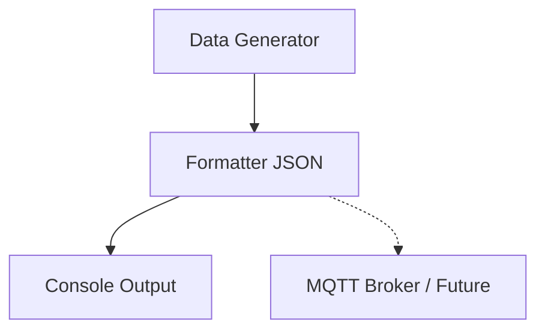

# Kiến trúc hệ thống: IoT Data Simulator

Dự án được thiết kế theo kiến trúc module đơn giản:
1. **Data Generator**: Chịu trách nhiệm sinh các thông số ngẫu nhiên theo phân phối chuẩn hoặc uniform.
2. **Formatter**: Chuyển đổi dữ liệu sang định dạng JSON.
3. **Output Interface**: Hiện tại in ra Console, tương lai sẽ đẩy qua MQTT Broker hoặc REST API.

